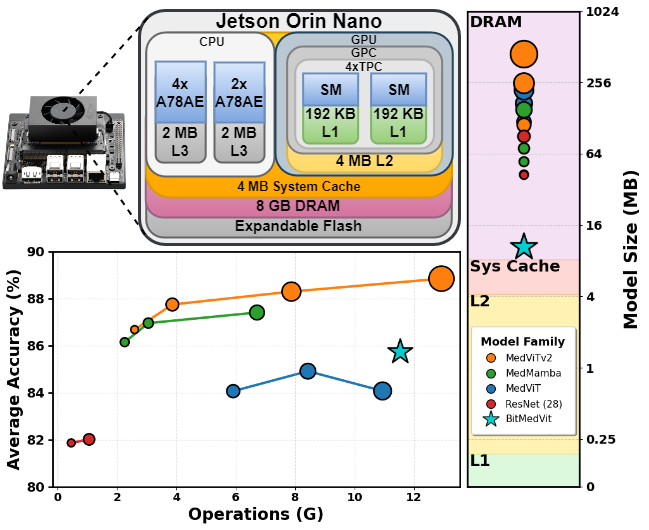
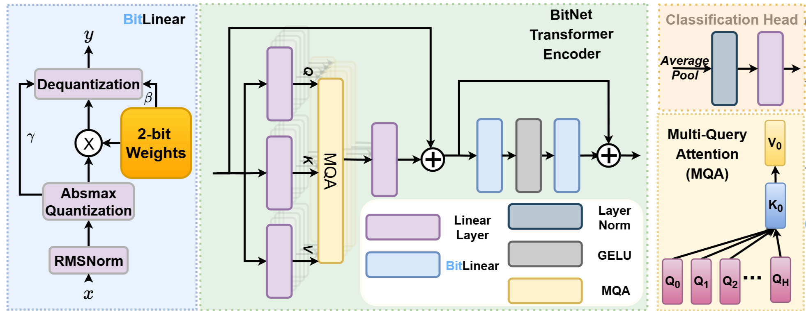
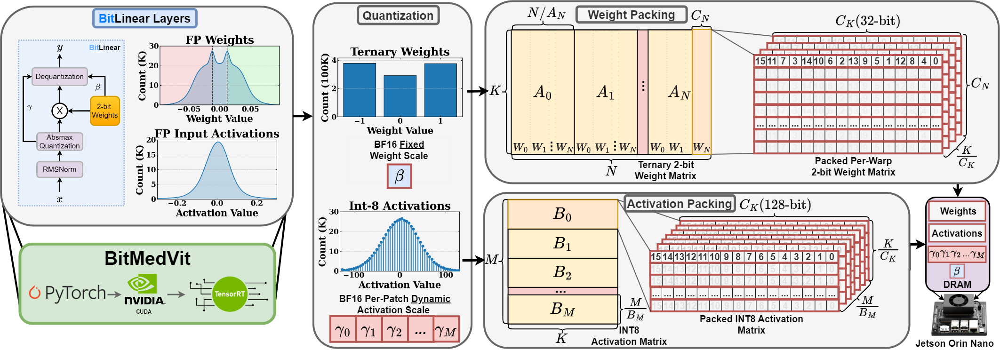
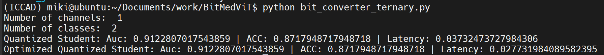

[](https://arxiv.org/abs/2510.13760)
<div align="center">
  <h1 style="font-family: Arial;">BitMedViT</h1>
  <h3>BitMedViT: Ternary Quantized Vision Transformer for Medical AI Assistants on the Edge</h3>
  
  [Mikolaj Walczak](https://www.linkedin.com/in/mikolaj-walczak-6423151b8/) ,[Uttej Kallakuri](https://www.linkedin.com/in/kallakuriniyogi/) ,[Edward Humes](https://www.linkedin.com/in/edward-humes-830b7217a/) ,[Xiaomin Lin](https://www.linkedin.com/in/xiaomin-lin/), and [Tinoosh Mohsenin](https://www.linkedin.com/in/tinoosh-mohsenin-352044b/)
 
  [Energy Efficient High Performance Computing Lab](https://eehpc.ece.jhu.edu/)  

  Original Work Invited, Published and Presented at the **44th Annual ICCAD 2025 Conference in Munich Germany**
</div>

<div align="center">
  <p></p>
  <em>Image Generated Using GPT-Image</em>
</div>

## Abstract
Vision Transformers (ViTs) have demonstrated strong capabilities in interpreting complex medical imaging data. However, their significant computational and memory demands pose challenges for deployment in real-time, resource-constrained mobile and wearable devices used in clinical environments. We introduce, BiTMedViT, a new class of Edge ViTs serving as medical AI assistants that perform structured analysis of medical images directly on the edge. BiTMedViT utilizes ternary- quantized linear layers tailored for medical imaging and com- bines a training procedure with multi-query attention, preserving stability under ternary weights with low-precision activations. Furthermore, BiTMedViT employs task-aware distillation from a high-capacity teacher to recover accuracy lost due to extreme quantization. Lastly, we also present a pipeline that maps the ternarized ViTs to a custom CUDA kernel for efficient memory bandwidth utilization and latency reduction on the Jetson Orin Nano. Finally, BiTMedViT achieves 86% diagnostic accuracy (89% SOTA) on MedMNIST across 12 datasets, while reducing model size by 43x, memory traffic by 39x, and enabling 16.8 ms inference at an energy efficiency up to 41x that of SOTA models at 183.62 GOPs/J on the Orin Nano. Our results demonstrate a practical and scientifically grounded route for extreme-precision medical imaging ViTs deployable on the edge, narrowing the gap between algorithmic advances and deployable clinical tools.
<div align="center">
  <p></p>
  Fig1: Jetson Orin Nano hierarchy and SOTA medical image classification model comparisons for average accuracy on the MedMNIST dataset vs operations and model size compared to the memory available within the GPU consisting of 4 TPCs each with two SMs containing their own L1 cache. Marker size corresponds to the parameter count within each model.
</div>


## TL;DR
BitMedViT introduces a model architecture and hardware deployment pipeline benchmarked on the MedMnist dataset highlighting:
* Edge-ready Vision Transformer tailored for medical image classification
* Ternary weights with low-precision activations for efficient inference
* Stable training via multi-query attention and task-aware knowledge distillation
* Custom CUDA + TensorRT deployment optimized for NVIDIA Jetson Orin Nano

## Overview
The BitMedViT training procedure consists of two main components (1) knowledge distillation from the state of the art teacher model MedViTv2 and (2) a compact ViT student architecture that implements multi-query attention and bitnet ternary layers. BitMedViT is benchmarked on each of the MedMnist datasets. As during this work the official MedViTv2 models were not published the teacher models were trained prior to distillation so accuracy results may vary.
<div align="center">
  <p></p>
  Fig2: Model training and distillation pipeline consisting of three loss terms: feature distillation, logit distillation, and hard label classification. These loss terms are scaled by individually which in the code are controlled via &gamma; for controlling which loss terms have priority for distillation and &alpha; for determining if distillation or hard label loss should be prioritized. For feature distillation an additional projection layer used only during training is introduced that is removed for deployment.
</div>
 

<div align="center">
  <p></p>
  Fig3: BitMedViT architecture for transformer encoder blocks including multi-query attention to compress the attention block and bitlinear 2-bit weight and 8-bit activation quantization for the feedforward projections. The traditional learnable positional embedding is used prior to the transformer encoders however for classification patch embeddings are averaged and passed into the final classification layer in contrast to the CLS token.
</div>

  
<div align="center">
  <p></p>
  Fig4: Deployment pipeline showing our pretrained model weights are discretized to 2-bit weights and packed into memory. We develop custom kernels that can be integrated into tensorRT enabling full model optimization for inference on the Jetson Orin Nano and other Ampere GPUs.
</div>


## BitMedViT Performance Results
Using the original MedMnist training procedure and dataset breadown we define a model architecutre with 3 transformer layers (L), an embedding dimension of 512 (E<sub>d</sub>), number of transformer heads as 8 (H) and a feedforward expansion of 4x or 2048 (E<sub>ff</sub>). In addition loss scales &gamma; and &alpha; both set to 0.5.
<div align="center">
  <p></p>
Fig 5: model grad cam performance compared to MedViTv2 teacher model on 3 sample datasets with key regions highlighted in green.
  
</div>

<div align="center">
Table 1: Test and Validation accuracy on the 12 MedMnist datasets in addition to trained model checkpoints
  
| **Dataset** | **Task** | **Validation**| **Testing**| **Model**|
|:-----------:|:--------:|:-----------------------:|:-----------------------:|:-----------------------:|
| **[PathMNIST](https://medmnist.com/)** | Multi-Class (9) | 87.0 | 82.1 |[Model](https://huggingface.co/BingoTBongo/BitMedViT/resolve/main/bloodmnist.pth) |
| **[ChestMNIST](https://medmnist.com/)** | Multi-Class (14) | 94.0 | 93.7 | [Model](https://huggingface.co/BingoTBongo/BitMedViT/resolve/main/chestmnist.pth) |
| **[DermaMNIST](https://medmnist.com/)** | Multi-Class (7) | 79.0 | 76.2 |[Model](https://huggingface.co/BingoTBongo/BitMedViT/resolve/main/dermamnist.pth)  |
| **[OCTMNIST](https://medmnist.com/)** | Multi-Class (4) | 95.0 | 85.7 |[Model](https://huggingface.co/BingoTBongo/BitMedViT/resolve/main/octmnist.pth)  |
| **[PneumoniaMNIST](https://medmnist.com/)** | Multi-Class (2) | 86.0 | 88.0 |[Model](https://huggingface.co/BingoTBongo/BitMedViT/resolve/main/pneumoniamnist.pth)  |
| **[RetinaMNIST](https://medmnist.com/)** | Multi-Class (5) | 53.0 | 51.3 |[Model](https://huggingface.co/BingoTBongo/BitMedViT/resolve/main/retinamnist.pth)  |
| **[BreastMNIST](https://medmnist.com/)** | Multi-Class (2) | 87.0 | 82.1 | [Model](https://huggingface.co/BingoTBongo/BitMedViT/resolve/main/breastmnist.pth) |
| **[BloodMNIST](https://medmnist.com/)** | Multi-Class (8) | 97.0 | 97.5 | [Model](https://huggingface.co/BingoTBongo/BitMedViT/resolve/main/bloodmnist.pth) | 
| **[TissueMNIST](https://medmnist.com/)** | Multi-Class (8) | 64.0 | 63.8 | [Model](https://huggingface.co/BingoTBongo/BitMedViT/resolve/main/tissuemnist.pth) |
| **[OrganAMNIST](https://medmnist.com/)** | Multi-Class (11) | 98.0 | 90.2 |[Model](https://huggingface.co/BingoTBongo/BitMedViT/resolve/main/organamnist.pth)  |
| **[OrganCMNIST](https://medmnist.com/)** | Multi-Class (11) | 96.0 | 88.4 |[Model](https://huggingface.co/BingoTBongo/BitMedViT/resolve/main/organcmnist.pth)  | 
| **[OrganSMNIST](https://medmnist.com/)** | Multi-Class (11) | 81.0 | 74.1 | [Model](https://huggingface.co/BingoTBongo/BitMedViT/resolve/main/organsmnist.pth) |
</div>

## BitMedViT Hardware Results
Using our custom kernel and TensorRT deployment we deploy BitMedViT on the Jetson Orin Nano and compare against deployment of the original MedVitv2-L teacher model to show boost in performance.
<div align="center">
Table 2: Hardware performance for individual image inference on the Jetson Orin Nano.
  
**Parameters (M)**| **Model Size (MB)**| **Operations (GOPs)**| **Power (W)**| **Latency (ms)** |  **Performance (GOPs / sec)**| **Energy Efficiency (GOPs / J)**|
|:-------:|:-------:|:-------:|:-------:|:-------:|:--------:|:--------:|
8.65 | 10.5 | 11.5 | 3.7 | 16.9 | 683.1 | 183.6 |
</div> 

## Getting Started
Begin by pulling this GitHub repository by any desired method. Then, install the conda environment found within ```environment.yml``` by running 
```shell
conda env env create -f environment.yml
```
Then activate the conda environment
```shell
conda activate bitmedvit_training
```
### Training
We provide pretrained BitMedViT models for the 12 MedMnist datasets however, to train BitMedViT on your own the prequisite is that the pretrained MedViTv2 model is available. For this work we trained our own teacher models from scratch but the offical pretrained versions can be pulled from following the instructions in the [MedViTv2 Github](https://github.com/Omid-Nejati/MedViTV2). To allow for simple setup we include a modified version of [MedViT.py](MedViT.py) and [dataset.py](dataset.py) within this repository to allow for feature distillation and some dataset optimizations. [fasterkan.py](fasterkan.py) is included however not modified.

After collecting the files the student can now be trained by running 
```shell
python distillbitvitv3 {args} # args are shown below
```
| Argument | Type | Default | Description |
|-----------|------|----------|-------------|
| `--batch_size` | `int` | `16` | Number of samples processed per training step. |
| `--epochs` | `int` | `100` | Number of training epochs to run. |
| `--lr` | `float` | `1e-4` | Learning rate for the optimizer. |
| `--T` | `float` | `2` | Temperature parameter (for KL Divergence). |
| `--L` | `int` | `3` | Number of layers in BitMedViT. |
| `--H` | `int` | `8` | Number of attention heads in BitMedViT. |
| `--dim` | `int` | `512` | Hidden dimension size for the model in BitMedViT (feedforward expansion of 4x built in). |
| `--alpha` | `float` | `0.5` | Balancing coefficient for loss terms or scaling factor. |
| `--dataset` | `str` | `'breastmnist'` | Dataset name (e.g., `breastmnist`, `pathmnist`, etc.). |
| `--gamma` | `float` | `0.5` | Learning rate decay or weighting factor (depending on usage). |
| `--multi_query` | `int` | `1` | Enables multi-query attention when set to `1` multi-head attention when set to `0`. |
| `--fp_attn` | `int` | `1` | If `1`, uses full-precision attention; and bitlinear attention when set to `0`. |
| `--save_dir` | `str` | `'./runs'` | Directory where experiment logs and models are saved. |
| `--data_dir` | `str` | `'./data'` | Directory containing dataset files. |
| `--teacher_dir` | `str` | `'./models'` | Directory where MedViTv2 trained model checkpoints are saved. |

After running the command the model will be found under the ```save_dir``` base directory following a format of 
```
{save_dir}/{muli_attn/multi_query}/{bit_attn/fp_attn}/{dataset}/{L#dim#H#}
```
Under this directory the logs at each training step in addition to the ```.pth``` model weights will be saved.

### Evaluation
We provide two methods of evaluation for BitMedViT. One is for accuracy and area under the curve as for the standard MedMnist dataset methods and another for visualizations and floating point operations found in [bitmedvit_comparison.ipynb](bitmedvit_comparison.ipynb). To evaluate accuracy we deploy on the Jetson Orin Nano for reporting final results using the optimized kernel. To deploy this install the latest JetPack version (6.2 used for this work) following the setup guide found [here](https://www.jetson-ai-lab.com/initial_setup_jon.html). Then ensure conda is installed, a simple tutorial is provided by Jetson Hacks shown [here](https://jetsonhacks.com/2024/11/04/install-anaconda-all-the-pythons-for-ai-ml/)

We provide a python environment that is used for evaluation and kernel deployment named ```jetson_environment.yml``` that can be installed using the same method as before
```shell
conda env install -f jetson_environment.yml
```
and activate
```shell
conda activate jetson_env
```
The evaluation scripts then can be run by running 
```shell
python bit_converter_ternary.py {args} # same arguments as for training script
```
Following the script the deployed model will be evaluated for default calculations in addition to applying the custom 2-bit kernel sample output shown below 
<div align="center">
  <p></p>
</div>
This script requires compilation of the custom kernel and serves as an initial debugging stage for verifying model performance prior to implementing into the final TensoRT optimized model. Details on doing so are discussed in the following section.

### Custom Kernel and TensorRT Deployment
As part of our deployment we provide custom Cuda Kernels optimized for utilizing tensor cores and asynchronous memory reads on the Ampere GPU of the Jetson Orin Nano. Details on compiling and setting up the kernel are found within [kernels](kernels). These kernels are inspired from the original [bitnet kernels]([https://github.com/microsoft/BitNet](https://github.com/microsoft/BitNet/tree/main/gpu) however heavily modified for ViT inference and GPU optimization.

***TensorRT Deployment and Instructions to Be Released***

## References
* [MedMnist](https://medmnist.com)
* [MedViTv2](https://github.com/Omid-Nejati/MedViTV2)
* [BitNet](https://github.com/microsoft/BitNet)
* [Vit-1.58b](https://github.com/DLYuanGod/ViT-1.58b)
* [BitNetTransformer](https://github.com/kyegomez/BitNet)

## Citation
```bibtex
@misc{walczak2025bitmedvit,
      title={Invited Paper: BitMedViT: Ternary-Quantized Vision Transformer for Medical AI Assistants on the Edge}, 
      author={Mikolaj Walczak and Uttej Kallakuri and Edward Humes and Xiaomin Lin and Tinoosh Mohsenin},
      year={2025},
      eprint={2510.13760},
      archivePrefix={arXiv},
      primaryClass={eess.IV},
      url={https://arxiv.org/abs/2510.13760}, 
}
```
