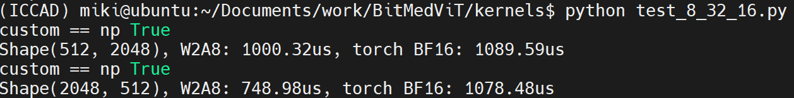

# BitMedViT Inference Kernels

This repository is inspired and inherits from the original [bitnet inference kernels](https://github.com/microsoft/BitNet/tree/main/gpu) adapted to produce multi-token inference kernels in contrast to single token kernels as in the original deployment. This kernel also utilizes the Tensor Cores and asynchronous memory reads found within the GPU of the Orin Nano. 

The only component preserved from the original kernels is the weight packing pattern. However, custom test scripts with reshaping patterns are provided to account for varying WMMA operations.

## Features

- Support for W2A8 (2-bit weight × 8-bit activation) **GEMM** computation  
- Custom CUDA kernels with low-latency execution
- Tensor Core utilization to maximise throughput
- Kernels provided for three WMMA fragment configurations: 8x32x16, 32x8x16, and 16x16x16 (MxNxK)
- Asynchronous reads during weight decoding enables latency hiding (currently only for 8x32x16)

## Usage

Installation and kernel performance tests:

```bash
# activate previously created environment
conda activate jetson_env

# Build the kernel
bash compile_{M}_{N}_{K}.sh # replace M N K with desired configuration (8x32x16 tested for highest performance)
cd ..

# Run performance tests
python test_{M}_{N}_{K}.py # replace M N K for compiled version
```
The test runs the kernel for the two feedforward dimensions present in BitMedViT. For specific dimensions the .cu files should be adjusted and tuned to match the desired shape.
A sample output is shown below
<div align="center">
  <p></p>
</div>

## Optimizations
### Weight Permutation
In contrast to bitnets original 16x32 (KxN) matrix breakdown pattern we provide kernels for all three configurations though 8x32x16 is the only one with asynchronous memory reads as it provides the optimal output pattern as both N and the number of threads per warp are 32 meaning during dequantization, write-backs result in contiguous streams not requiring any reshaping or strided data writes.

### WMMA Operation
We use ```WMMA``` as the main computing backbone that devices the activation and weight matrices into fragments passed into the tensor cores found within the streaming multiprocessors of the GPU.

These operations currently support 3 fragment dimensions of 8x32x16, 32x8x16, and 16x16x16. The final TensorRT deployment integrates the 8x32x16 variant however can easily be swapped for deployment.

### Asynchronous memory reads
To hide any latencies incrued during weight decoding (outlined by original bitnet implementation) we integrate asynchronous memory reads introduced in GPUs with compute capabilities >8.0. Currently only integrated within 8x32x16 configuration.

### Computing Breakdown
In contrast to bitnet that uses 128 total threads and ```shuffle_down_sync``` to accumulate across threads ```WMMA``` requires operation in warps or groups of 32 threads therefore we define a 3D dimension of 8x4xZ where 8 aligns with the original decoding style, 4 outlining the number of these groups to complete a warp and Z being a tunable parameter for tiling across number of outputs N. In addition to maximize occupancy we divide the computation into blocks of shape ```AxB``` where ```A``` outlines the output neuron dimension and ```B``` outlines the input patch dimension.

### Kernel Benchmarking
Besides latency and correctness evaluation against standard bfloat16 kernels we use [Nvidia Nsight Compute](https://developer.nvidia.com/nsight-compute) to profile and ensure the kernels are as optimized and efficient as possible. Custom scripts should be written for desired profiling level.
